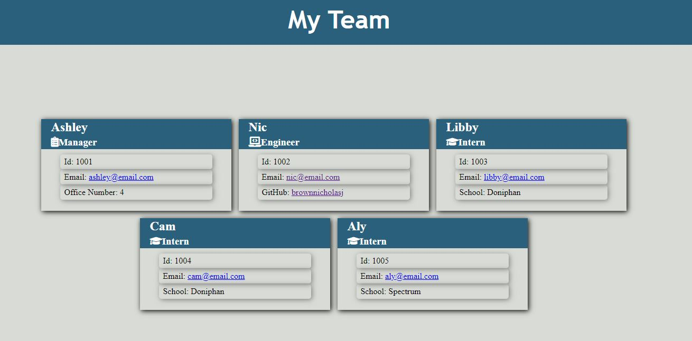
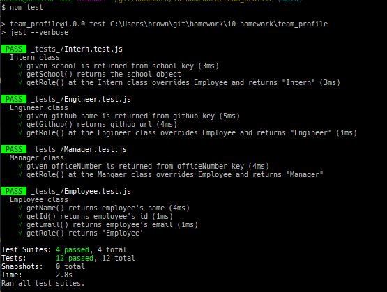
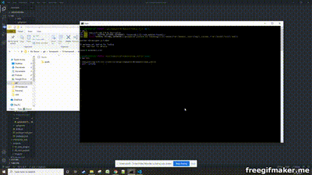
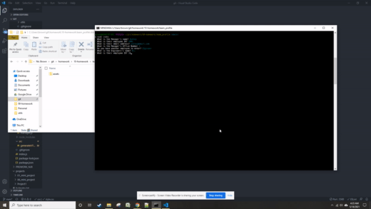
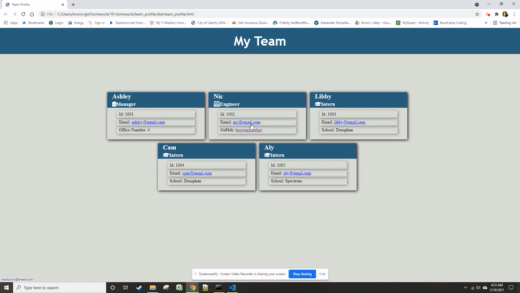
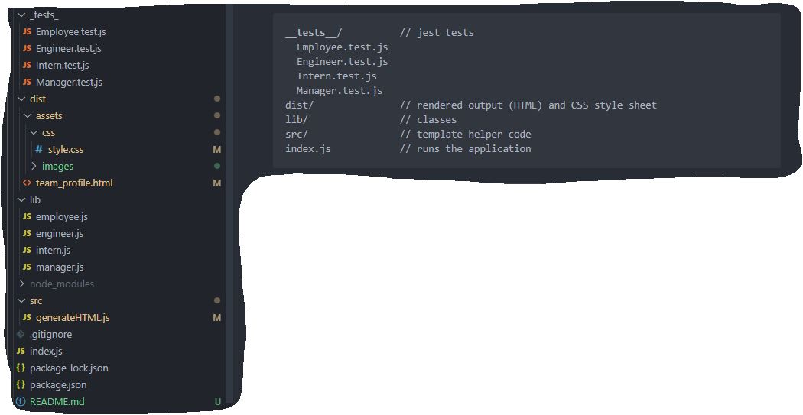
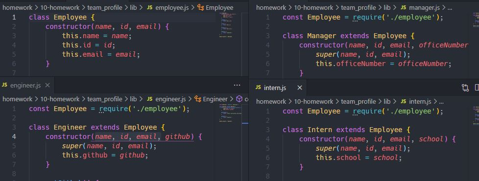
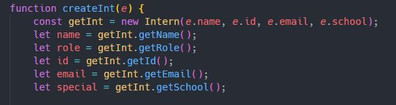

# Team Profile Application


## Description

- The application will take user input from Command Line Input (CLI) to generate
  a HTML page with clickable links to email and github pages. This provides a
  quick access to these points of information for a team for optimal utilization
- The technology used for this application are: node, javascript, npm, npm
  inquirer, npm chalk, npm jest (dev only), fontawesome (html images)
- The biggest challenge I had was handling the requests for class extension,
  however once I got a bit of experience with what the program(s) expect, it
  became a lot clearer

## Table of Contents

- [Installation](#installation)
- [Usage](#usage)
- [License](#license)
- [Contributing](#contributing)
- [Tests](#tests)
- [Questions](#questions)

## Installation

To install necessary dependencies, run the following command:

```
npm i
```

The following dependencies will be installed:

- inquirer
- chalk

dev dependency

- jest

## Usage

A user will run the application and respond to the prompts, based on the input
received, the program will generate a HTML file that utilizes a directory css to
show the input in an intuitive, interactive (clickable) webpage.

A user and/or team will then have quick access to team information along with
ability to email and/or get to a github repository with one click.

## License

This project is licensed under the MIT license.

## Contributing

A thanks to the following contributors to this project: Nicholas Brown
(brownnicholasj.dev@gmail.com)

## Test

Setup:

1.  run the npm install command to install all dependencies

```
npm i
```

Test Plans:

1. <br>

   - Run the below command and walk through the questions answering as desired

   ```
   node index
   ```

   - Open the HTML file from the 'dist/' file
   - Click on one of the email hrefs and verify default email program opens with
     the clicked email address in the 'To' line
     - **requires default email to be setup with browser**
   - Click on one of the github hrefs to be taken to the github profile
     - **link is "https://github.com/username" - a valid username is required**

1. <br>

   - Run the below command and walk through the questions, ensuring you input 5
     or more employees

   ```
   node index
   ```

   - Open the HTML file from the 'dist/' file
   - Validate the profiles are wrapped 

1. <br>

   - Run the below command to run the unit testing

   ```
   npm test
   ```

   - Validate that all unit tests pass 

## Demo

Click the following link to watch video demo of the application (1m45sec
runtime)<br> https://youtu.be/6DWQlZiK_Tw

Install required dependencies: <br> 

Run unit tests: <br> 

The input from the user: <br> 

HTML output and clickable links: <br> 

The file structure/organization is setup as: <br>


### Behind the Code

- The classes are setup with Employee as the first class and
  Manager/Engineer/Inter are extensions of the Employee class <br>
  

- Retrieve the information utilizing the Class modules: <br>
  

## Questions

If you have any questions about the repo, open an issue or contact me directly
at brownnicholasj.dev@gmail.com.You can find more of my work at
[brownnicholasj](https://github.com/brownnicholasj/).
